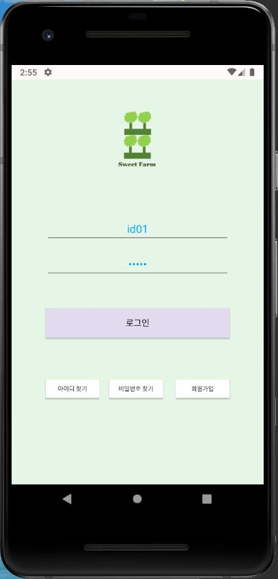
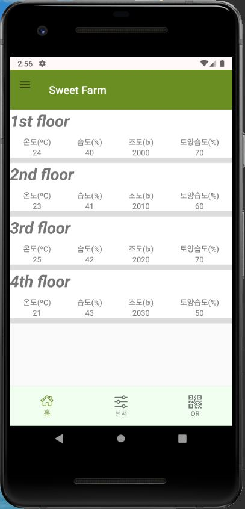
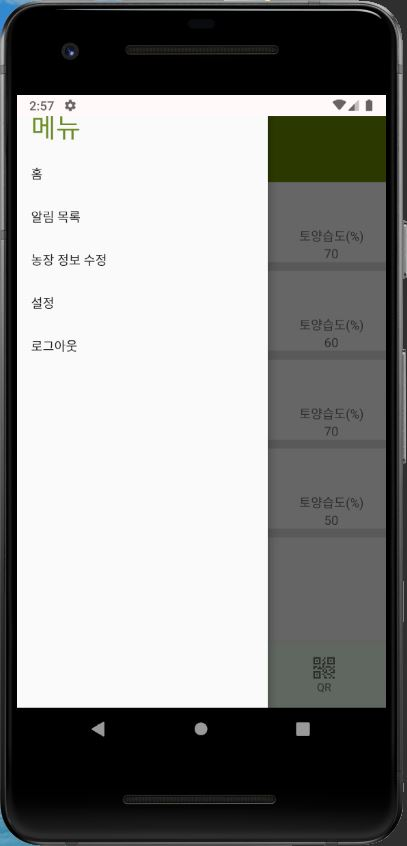

# Android 기본 기능 구현 프로젝트

## 주제 : Smart Farm

### 1. 로그인(Log in)

* MainActivity 에서 로그인이 완료되면 SecondActivity(Home)로 이동한다.

### 2. 홈 화면(Home)

* ListView 를 사용해 스마트 농장의 각 층을 나열한다.
* 하단 내비게이션 바를 사용하고 Fragment로 화면을 전환한다.
* 상단 부분은 Actionbar를 Toolbar로 대체하고 Drawer Layout을 사용해 슬라이드 메뉴를 적용한다.
* 화면에 보이는 데이터 값은 JSON 데이터로 가져온다.(나중에 센서에서 받은 데이터로 대체 예정)

### 3. 슬라이드 메뉴(Navigation Drawer)

* 메뉴에서 각 항목을 클릭 시 해당 Fragment로 이동한다.
* 로그아웃 클릭 시 로그아웃 되어 로그인 페이지(MainActivity)로 이동한다.

